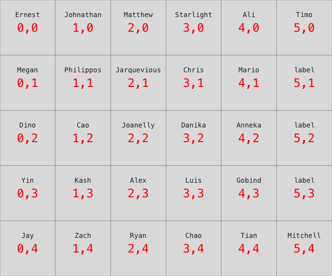

# shared-canvas
 
Shared Canvas is a project where you are responsible for a a single square in a grid. Draw whatever you like in your grid square!

## Getting Started

Find your name on the grid. You're responsible for making sure your drawing ends up in that location. 

Each grid square is 113px by 113px. 

The canvas is 6 by 5 grid squares and 678px by 565px. 

- Width 6 squares (113px * 6) 678px
- Height 5 squares (113px * 5) 565px

For example: Mitchell has been assign to square 4, 3. All of the drawing they do must fall within a square starting at x of 452 and y of 339 and ending at x of 565 and y of 452. 

- left 4 * 113 = 452
- top 3 * 113 = 339
- right 4 * 113 + 113 = 565
- bottom 3 * 113 + 113 = 452

Here's a picture illustrating where their drawing should end up. 


To draw you should create a JS with your name. In this file import `ctx` and `size`.

```JS
import ctx, { size } from './main.js'

const x = 4 * size
const y = 3 * size
```

`ctx` is your drawing context. Use to call any of the drawing methods. 

`size` is the a constant that defines the size of each square (113.)

The constants x and y that have define above locate the upper left corner of the box that I will draw in. 

Take a look at [mitchell.js](mitchell.js) to get ideas on how to draw shapes. 

Find your name in the image below and adjust your drawing so that is draws within the correct location. 



## What to do

- Fork this repo
- Find your name on the grid
- Make a new js file using your name
- import the ctx and size from main
- use the canvas API to draw in your area of the shared canvas
- Test your work in the fork of the project
- Updating index.html. Find your name in a comment and add a script tag that links to your JS file.
- When you're happy and bug free create a pull request to incorporate your work into the original project

### Fork

A fork is a copy of the original project that is moved to your github account. 

Click the Fork button in the upper right of the page. 

### import code 

Your JS file should use this code

```JS
import ctx, { size } from './main.js'
ctx.restore()
const x = 4 * size
const y = 3 * size
```

The x and y properties here will provide the location of the upper left corner of the square where your drawing will reside. 

Since the canvas context is shared your code may pick up styles or settings from other code. Use: 

```js
ctx.restore();
```

to reset the canvas context before you start drawing. 

### update index.html

Add a link to your script in a script tag here. 

```HTML
<script src="test.js" type="module"></script>
```

be sure to include `type="module"` since this project is using JS modules!

### Make a pull request

Go to your project GitHub.com go to the **Pull Requests** tab. Click the Green button: **New Pull Request**. Type a message and submit your pull request. 

### Updating your from upstream

Git projects have branches. You'll always have a master branch and you might create other branches. 

https://git-scm.com/docs/gitglossary#Documentation/gitglossary.txt-aiddefbranchabranch

An upstream branch can refer to a branch that belongs to source repo you forked. 

https://git-scm.com/docs/gitglossary#Documentation/gitglossary.txt-aiddefupstreambranchaupstreambranch

Merge is the process of combining branches. Merges can have conflicts when it seems that same code has been edited in two places. If you get a merge conflict you'll have to manually edit code to resolve the conflict. 

https://git-scm.com/docs/gitglossary#Documentation/gitglossary.txt-aiddefmergeamerge

To update your fork of this project you'll want to: Merge the upstream master branch with your master branch. 

Using the command line follow the instructions here: 

https://docs.github.com/en/free-pro-team@latest/github/collaborating-with-issues-and-pull-requests/syncing-a-fork

Using GitHub Desktop follow these:

https://stackoverflow.com/questions/46110615/how-to-sync-your-forked-repo-with-original-repo-in-github-desktop

